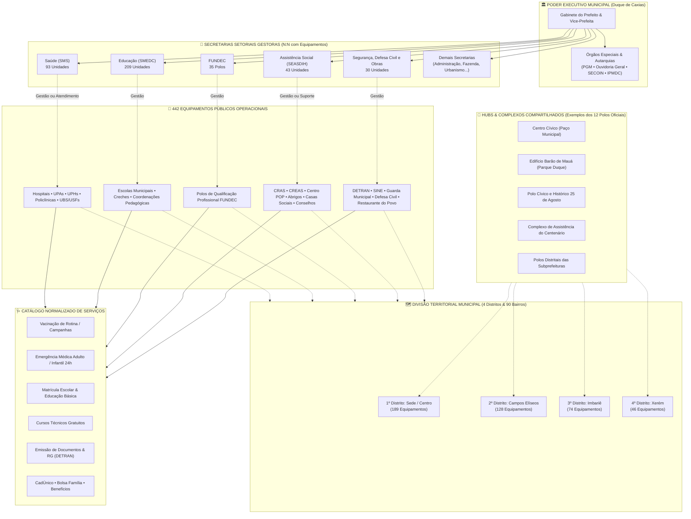
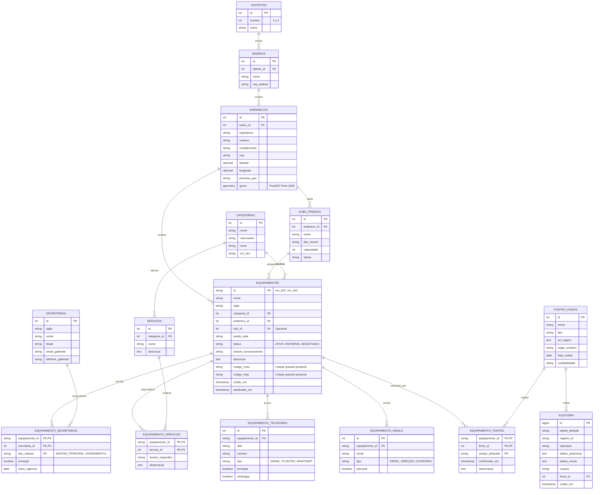

# 🏛️ Especificação Técnica V2: Arquitetura Corporativa de Dados & SIG Municipal
## Município de Duque de Caxias — RJ | Base Oficial Consolidada 2026

> **Documento Oficial de Engenharia de Dados, Geoprocessamento e Rastreabilidade**  
> **Versão:** 2.0 (Arquitetura Corporativa Normalizada com PostGIS, Auditoria e Procedência)  
> **Status:** Especificação Técnica Oficial de Referência  
> **Escopo Territorial & Administrativo:** 442 Equipamentos Públicos | 12 Hubs Compartilhados | 4 Distritos | 90 Bairros  

---

## 1. Evolução Arquitetural: Da Modelagem Cadastral (V1) para o SIG Corporativo (V2)

A versão inicial (V1) resolveu com sucesso a normalização dos 442 equipamentos, distritos e categorias para consumo em planilhas e no painel web.  
A presente **Versão 2.0 (V2)** eleva o modelo a um padrão corporativo de **Sistema de Informações Geográficas (SIG-Municipal)** e **Repositório Central de Dados (MDM - Master Data Management)**, incorporando as 11 melhorias críticas de integridade, auditoria e geoprocessamento:

| # | Pilar V2 | O que mudou em relação à V1 | Benefício Direto |
| :-: | :--- | :--- | :--- |
| **1** | **Entidade `enderecos` desacoplada** | Endereço físico e coordenadas pertencem a um imóvel/lote, não ao equipamento. | Elimina redundância quando múltiplos órgãos ocupam o mesmo logradouro/prédio. |
| **2** | **Relação N:N `equipamento_secretarias`** | Um equipamento pode ter gestão principal de uma secretaria e acolher serviços de outras. | Modela hospitais e polos integrados que reúnem Saúde, Assistência e Cidadania. |
| **3** | **Normalização de `servicos`** | Serviços deixam de ser campo `TEXT` solto e viram catálogo normalizado N:N. | Permite consultas inteligentes (ex.: *"Quais postos oferecem vacinação de febre amarela?"*). |
| **4** | **Auditoria e Histórico (`auditoria`)** | Tabela imutável de eventos com dados anteriores, novos, usuário e timestamp. | Rastreabilidade total: quem alterou, quando e por que motivo. |
| **5** | **Procedência e Fontes (`fontes_dados`)** | Mapeamento da origem de cada dado (API da Transparência, CNES, INEP, OrientaHub, Diário Oficial). | Auditoria de confiabilidade e transparência pública. |
| **6** | **Contatos Normalizados (Telefones e E-mails)** | Tabelas filhas `equipamento_telefones` e `equipamento_emails`. | Suporte a múltiplos ramais, WhatsApp, telefones de plantão 24h e ouvidorias. |
| **7** | **Status Operacional Padronizado** | Controle de ciclo de vida (`ATIVO`, `TEMPORARIAMENTE_FECHADO`, `DESATIVADO`, etc.). | Preserva histórico: escolas ou postos desativados nunca são deletados fisicamente. |
| **8** | **Geometrias Espaciais PostGIS (`geom`)** | Suporte a pontos e polígonos espaciais em `GEOMETRY(Point, 4326)`. | Análises geoespaciais avançadas (raio de distância, buffer, mapa de calor, zonas de atendimento). |
| **9** | **Hubs Prediais com Gestão Imobiliária** | `hubs_predios` com regime do imóvel (próprio, alugado, cedido), capacidade e endereço próprio. | Gestão patrimonial e de locação da Prefeitura. |
| **10**| **Constraints e Índices Rigorosos** | `CHECK`, `UNIQUE` condicionais (CNES e INEP) e índices compostos de busca. | Blindagem do banco contra duplicidades e inconsistências de digitação. |
| **11**| **Retrocompatibilidade por VIEW** | Criação da `vw_equipamentos_consolidada`. | O painel web (`index.html`), CSVs e scripts continuam funcionando sem refatoração. |

---

## 2. Organograma Institucional, Territorial e Operacional

O diagrama abaixo ilustra a governança e o fluxo de serviços do município, detalhando como as secretarias gestoras supervisionam os equipamentos distribuídos pelos **4 Distritos**, operando em sedes exclusivas ou nos **12 Hubs Compartilhados**:

> **Nota Metodológica sobre os Hubs:**  
> O diagrama exibe os 5 maiores polos como representação didática dos **12 Hubs/Complexos compartilhados** catalogados no município (Centro Cívico / Paço Municipal, Ed. Barão de Mauá, Polo Cívico 25 de Agosto, Complexo Centenário, Polo Beira Mar, Alameda James Franco, Bartolomeu Gusmão, Polos Regionais das Subprefeituras, etc.).



---

## 3. Blueprint V2 em Caixas, Colunas e Relações

Abaixo está o esquema arquitetural completo desenhado em **caixas e colunas**, detalhando todas as chaves primárias (`[PK]`), estrangeiras (`[FK]`), campos únicos (`[UQ]`) e restrições de validação (`[CK]`):

```text
┌─────────────────────────────────────────────────────────────┐
│                      TABELA: distritos                      │
├──────┬──────────────────────┬──────────────┬────────────────┤
│ CHV  │ COLUNA               │ TIPO         │ RESTRIÇÃO      │
├──────┼──────────────────────┼──────────────┼────────────────┤
│ [PK] │ id                   │ INTEGER      │ AUTOINCREMENT  │
│ [UQ] │ numero               │ INTEGER      │ CHECK (1..4)   │
│      │ nome                 │ VARCHAR(100) │ NOT NULL       │
└──────┴──────────┬───────────┴──────────────┴────────────────┘
                  │ 1
                  │ (possui 1:N)
                  ▼
┌─────────────────────────────────────────────────────────────┐
│                       TABELA: bairros                       │
├──────┬──────────────────────┬──────────────┬────────────────┤
│ CHV  │ COLUNA               │ TIPO         │ RESTRIÇÃO      │
├──────┼──────────────────────┼──────────────┼────────────────┤
│ [PK] │ id                   │ INTEGER      │ AUTOINCREMENT  │
│ [FK] │ distrito_id          │ INTEGER      │ NOT NULL       │
│      │ nome                 │ VARCHAR(100) │ NOT NULL       │
│      │ cep_padrao           │ VARCHAR(10)  │                │
│ [UQ] │ (distrito_id, nome)  │ COMPOSTO     │ Sem duplicação │
└──────┴──────────┬───────────┴──────────────┴────────────────┘
                  │ 1
                  │ (localiza 1:N)
                  ▼
┌─────────────────────────────────────────────────────────────┐
│                      TABELA: enderecos                      │
├──────┬──────────────────────┬──────────────┬────────────────┤
│ CHV  │ COLUNA               │ TIPO         │ DESCRIÇÃO      │
├──────┼──────────────────────┼──────────────┼────────────────┤
│ [PK] │ id                   │ INTEGER      │ AUTOINCREMENT  │
│ [FK] │ bairro_id            │ INTEGER      │ NOT NULL       │──┐
│      │ logradouro           │ VARCHAR(150) │ Rua, Av, Rod   │  │
│      │ numero               │ VARCHAR(20)  │ S/Nº ou número │  │
│      │ complemento          │ VARCHAR(100) │ Bloco, Lote, Km│  │
│      │ cep                  │ VARCHAR(10)  │ 25000-000      │  │
│      │ latitude             │ DECIMAL(10,8)│ GPS Lat        │  │
│      │ longitude            │ DECIMAL(11,8)│ GPS Lon        │  │
│      │ precisao_geo         │ VARCHAR(30)  │ NUMERO/ESTIMADO│  │
│      │ geom                 │ GEOMETRY     │ Point (SRID 4326)│
└──────┴──────────┬───────────┴──────────────┴────────────────┘  │
                  │ 1                                            │
                  │ (referenciado por 1:N)                       │
                  ├───────────────────────────────┐              │
                  ▼ 1                             ▼ 1            │
┌─────────────────────────────────┐ ┌─────────────────────────┐  │
│      TABELA: hubs_predios       │ │  TABELA: categorias     │  │
├──────┬──────────────┬───────────┤ ├──────┬────────────┬─────┤  │
│ CHV  │ COLUNA       │ TIPO      │ │ CHV  │ COLUNA     │ TIPO│  │
├──────┼──────────────┼───────────┤ ├──────┼────────────┼─────┤  │
│ [PK] │ id           │ INTEGER   │ │ [PK] │ id         │ INT │  │
│      │ nome         │ VARCHAR   │ │ [UQ] │ nome       │ VAR │  │
│ [FK] │ endereco_id  │ INTEGER   │ │      │ macrosetor │ VAR │  │
│      │ tipo_imovel  │ VARCHAR   │ │      │ icone      │ VAR │  │
│      │ capacidade   │ INTEGER   │ │      │ cor_hex    │ VAR │  │
│      │ status       │ VARCHAR   │ └──────┴─────┬──────┴─────┘  │
└──────┴──────┬───────┴───────────┘              │ 1             │
              │ 1 (comporta 1:N)                 │               │
              │                                  │ (classifica)  │
              ▼ N (opcional)                     │               │
┌────────────────────────────────────────────────┴───────────────┴─────────────────────────────┐
│                                    TABELA: equipamentos                                      │
├──────┬──────────────────────┬──────────────┬─────────────────────────────────────────────────┤
│ CHV  │ COLUNA               │ TIPO         │ DESCRIÇÃO / VALIDAÇÃO                           │
├──────┼──────────────────────┼──────────────┼─────────────────────────────────────────────────┤
│ [PK] │ id                   │ VARCHAR(30)  │ Código alfanumérico único (ex: rec_001..rec_442)│
│      │ nome                 │ VARCHAR(200) │ Nome oficial completo da unidade                │
│      │ sigla                │ VARCHAR(50)  │ Nome usual / abreviatura (ex: HMMRC, CRAESM)    │
│ [FK] │ categoria_id         │ INTEGER      │ NOT NULL (Saúde, Educação, etc.)                │
│ [FK] │ endereco_id          │ INTEGER      │ NOT NULL (Vinculação direta ao lote/imóvel)     │
│ [FK] │ hub_id               │ INTEGER      │ NULL se imóvel próprio isolado                  │
│      │ predio_sala          │ VARCHAR(100) │ Detalhe interno (ex: Pavimento 2, Sala 204)     │
│      │ status               │ VARCHAR(30)  │ ATIVO / TEMPORARIAMENTE_FECHADO / DESATIVADO    │
│      │ horario_funcionamento│ VARCHAR(100) │ Expediente (24 Horas, Seg-Sex 8h-17h, etc.)     │
│      │ descricao            │ TEXT         │ Resumo institucional da unidade                 │
│ [UQ] │ codigo_cnes          │ VARCHAR(20)  │ Cadastro Nacional de Saúde (NULL permitido)     │
│ [UQ] │ codigo_inep          │ VARCHAR(20)  │ Código MEC/INEP de Escolas (NULL permitido)     │
│      │ criado_em            │ TIMESTAMP    │ Data de cadastro inicial                        │
│      │ atualizado_em        │ TIMESTAMP    │ Data e hora da última revisão                   │
└──────┴───┬──────────────┬───┴──────────────┴─────────────────────────────────────────────────┘
           │              │
           │              └─────────────────────────────────────────────────────┐
           │                                                                    │
           ▼ N                                                                  ▼ N
┌─────────────────────────────┐ ┌───────────────────────────┐ ┌─────────────────────────────────┐
│  equipamento_secretarias    │ │   equipamento_servicos    │ │     equipamento_telefones       │
├──────┬──────────────┬───────┤ ├──────┬──────────────┬─────┤ ├──────┬──────────────┬───────────┤
│ CHV  │ COLUNA       │ TIPO  │ │ CHV  │ COLUNA       │ TIPO│ │ CHV  │ COLUNA       │ TIPO      │
├──────┼──────────────┼───────┤ ├──────┼──────────────┼─────┤ ├──────┼──────────────┼───────────┤
│[PK/FK│equipamento_id│VARCHAR│ │[PK/FK│equipamento_id│VAR  │ │ [PK] │ id           │ INTEGER   │
│[PK/FK│secretaria_id │INTEGER│ │[PK/FK│servico_id    │INT  │ │ [FK] │equipamento_id│ VARCHAR   │
│[PK]  │tipo_relacao  │VARCHAR│ │      │horario_espec │VAR  │ │      │ ddd          │ VARCHAR(3)│
│      │principal     │BOOLEAN│ │      │observacao    │TEXT │ │      │ numero       │ VARCHAR   │
│      │inicio_vigenc │DATE   │ └──────┴──────┬───────┴─────┘ │      │ tipo         │ PLANTÃO...│
└──────┴──────┬───────┴───────┘               │ N             │      │ principal    │ BOOLEAN   │
              │ N                             │ 1             │      │ whatsapp     │ BOOLEAN   │
              ▼ 1                             ▼               └──────┴──────────────┴───────────┘
┌─────────────────────────────┐ ┌───────────────────────────┐
│     TABELA: secretarias     │ │     TABELA: servicos      │ ┌─────────────────────────────────┐
├──────┬──────────────┬───────┤ ├──────┬──────────────┬─────┤ │      equipamento_emails         │
│ CHV  │ COLUNA       │ TIPO  │ │ CHV  │ COLUNA       │ TIPO│ ├──────┬──────────────┬───────────┤
├──────┼──────────────┼───────┤ ├──────┼──────────────┼─────┤ │ [PK] │ id           │ INTEGER   │
│ [PK] │ id           │INTEGER│ │ [PK] │ id           │ INT │ │ [FK] │equipamento_id│ VARCHAR   │
│ [UQ] │ sigla        │VARCHAR│ │ [UQ] │ nome         │ VAR │ │      │ email        │ VARCHAR   │
│      │ nome         │VARCHAR│ │ [FK] │ categoria_id │ INT │ │      │ tipo         │ GERAL/DIR │
│      │ titular      │VARCHAR│ │      │ descricao    │ TEXT│ │      │ principal    │ BOOLEAN   │
│      │ email_gab    │VARCHAR│ └──────┴──────────────┴─────┘ └──────┴──────────────┴───────────┘
│      │ telefone_gab │VARCHAR│
└──────┴──────────────┴───────┘

┌─────────────────────────────────────────────────────────────┐
│             TABELA: auditoria (Trilha Imutável)             │
├──────┬──────────────────────┬──────────────┬────────────────┤
│ CHV  │ COLUNA               │ TIPO         │ DESCRIÇÃO      │
├──────┼──────────────────────┼──────────────┼────────────────┤
│ [PK] │ id                   │ BIGINT       │ Sequencial     │
│      │ tabela_afetada       │ VARCHAR(50)  │ Nome da tabela │
│      │ registro_id          │ VARCHAR(50)  │ ID do registro │
│      │ operacao             │ VARCHAR(20)  │ INSERT/UPD/DEL │
│      │ dados_anteriores     │ JSON / TEXT  │ Snapshot antes │
│      │ dados_novos          │ JSON / TEXT  │ Snapshot novo  │
│      │ usuario              │ VARCHAR(100) │ Matrícula/Login│
│ [FK] │ fonte_id             │ INTEGER      │ -> fontes_dados│
│      │ criado_em            │ TIMESTAMP    │ Data do evento │
└──────┴──────────────────────┴──────────────┴────────────────┘

┌─────────────────────────────────────────────────────────────┐
│                 TABELA: fontes_dados (Origem)               │
├──────┬──────────────────────┬──────────────┬────────────────┤
│ CHV  │ COLUNA               │ TIPO         │ DESCRIÇÃO      │
├──────┼──────────────────────┼──────────────┼────────────────┤
│ [PK] │ id                   │ INTEGER      │ AUTOINCREMENT  │
│      │ nome                 │ VARCHAR(100) │ Nome da base   │
│      │ tipo                 │ VARCHAR(50)  │ API/CNES/SQL...│
│      │ url_origem           │ TEXT         │ Link / Reposit.│
│      │ orgao_emissor        │ VARCHAR(100) │ Min. Saúde/MEC │
│      │ data_coleta          │ DATE         │ Data do dump   │
│      │ confiabilidade       │ VARCHAR(30)  │ OFICIAL/ALTA   │
└──────┴──────────┬───────────┴──────────────┴────────────────┘
                  │ 1
                  │ (atribui 1:N)
                  ▼
┌─────────────────────────────────────────────────────────────┐
│                 TABELA: equipamento_fontes                  │
├──────┬──────────────────────┬──────────────┬────────────────┤
│ CHV  │ COLUNA               │ TIPO         │ DESCRIÇÃO      │
├──────┼──────────────────────┼──────────────┼────────────────┤
│[PK/FK│ equipamento_id       │ VARCHAR(30)  │ -> equipamentos│
│[PK/FK│ fonte_id             │ INTEGER      │ -> fontes_dados│
│[PK]  │ campo_atribuido      │ VARCHAR(50)  │ TELEFONE/HORAS │
│      │ confirmado_em        │ TIMESTAMP    │ Data validação │
│      │ observacao           │ TEXT         │ Detalhes       │
└──────┴──────────────────────┴──────────────┴────────────────┘
```

---

## 4. Diagrama de Entidade-Relacionamento Completo (MER Mermaid)



---

## 5. Script SQL Físico Completo (PostgreSQL + PostGIS / SQLite)

O DDL abaixo inclui todas as chaves primárias, estrangeiras, índices espaciais, índices compostos e checagens de validação:

```sql
-- ============================================================================
-- SCRIPT DE CRIAÇÃO DO BANCO DE DADOS CORPORATIVO MUNICIPAL (V2)
-- Compatível com: PostgreSQL (com PostGIS) e SQLite (usando tipos nativos)
-- ============================================================================

-- Habilitar extensão espacial se estiver no PostgreSQL
-- CREATE EXTENSION IF NOT EXISTS postgis;

-- 1. DISTRITOS (1 a 4)
CREATE TABLE distritos (
    id INTEGER PRIMARY KEY,
    numero INTEGER NOT NULL UNIQUE CHECK (numero BETWEEN 1 AND 4),
    nome VARCHAR(100) NOT NULL
);

-- 2. BAIRROS (90 Bairros)
CREATE TABLE bairros (
    id INTEGER PRIMARY KEY,
    distrito_id INTEGER NOT NULL REFERENCES distritos(id),
    nome VARCHAR(100) NOT NULL,
    cep_padrao VARCHAR(10),
    CONSTRAINT unq_bairro_distrito UNIQUE (distrito_id, nome)
);

-- 3. ENDEREÇOS FÍSICOS (Lotes e Coordenadas)
CREATE TABLE enderecos (
    id INTEGER PRIMARY KEY,
    bairro_id INTEGER NOT NULL REFERENCES bairros(id),
    logradouro VARCHAR(150) NOT NULL,
    numero VARCHAR(20) DEFAULT 's/nº',
    complemento VARCHAR(100),
    cep VARCHAR(10) NOT NULL,
    latitude DECIMAL(10, 8),
    longitude DECIMAL(11, 8),
    precisao_geo VARCHAR(30) DEFAULT 'NUMERO_EXATO' 
        CHECK (precisao_geo IN ('NUMERO_EXATO', 'APROXIMADO_LOGRADOURO', 'CENTROIDE_BAIRRO', 'ESTIMADO')),
    -- Campo geométrico (PostGIS)
    -- geom GEOMETRY(Point, 4326),
    criado_em TIMESTAMP DEFAULT CURRENT_TIMESTAMP
);

-- 4. HUBS E PRÉDIOS COMPARTILHADOS (12 Polos Municipais)
CREATE TABLE hubs_predios (
    id INTEGER PRIMARY KEY,
    nome VARCHAR(150) NOT NULL,
    endereco_id INTEGER NOT NULL REFERENCES enderecos(id),
    tipo_imovel VARCHAR(50) DEFAULT 'PROPRIO_MUNICIPAL'
        CHECK (tipo_imovel IN ('PROPRIO_MUNICIPAL', 'LOCADO', 'CEDIDO_ESTADO', 'CEDIDO_UNIAO', 'CONVENIADO')),
    capacidade INTEGER,
    status VARCHAR(30) DEFAULT 'ATIVO'
        CHECK (status IN ('ATIVO', 'EM_REFORMA', 'DESATIVADO')),
    descricao TEXT,
    criado_em TIMESTAMP DEFAULT CURRENT_TIMESTAMP,
    atualizado_em TIMESTAMP DEFAULT CURRENT_TIMESTAMP
);

-- 5. CATEGORIAS DE ATENDIMENTO
CREATE TABLE categorias (
    id INTEGER PRIMARY KEY,
    nome VARCHAR(80) NOT NULL UNIQUE,
    macrosetor VARCHAR(80) NOT NULL,
    icone VARCHAR(30),
    cor_hex VARCHAR(10)
);

-- 6. SECRETARIAS E ÓRGÃOS GESTORES
CREATE TABLE secretarias (
    id INTEGER PRIMARY KEY,
    sigla VARCHAR(20) NOT NULL UNIQUE,
    nome VARCHAR(150) NOT NULL,
    titular VARCHAR(100),
    email_gabinete VARCHAR(120),
    telefone_gabinete VARCHAR(50)
);

-- 7. TABELA MESTRA DE EQUIPAMENTOS PÚBLICOS (442 Unidades)
CREATE TABLE equipamentos (
    id VARCHAR(30) PRIMARY KEY,
    nome VARCHAR(200) NOT NULL,
    sigla VARCHAR(50),
    categoria_id INTEGER NOT NULL REFERENCES categorias(id),
    endereco_id INTEGER NOT NULL REFERENCES enderecos(id),
    hub_id INTEGER REFERENCES hubs_predios(id),
    predio_sala VARCHAR(100),
    status VARCHAR(30) NOT NULL DEFAULT 'ATIVO'
        CHECK (status IN ('ATIVO', 'INATIVO', 'TEMPORARIAMENTE_FECHADO', 'EM_IMPLANTACAO', 'DESATIVADO')),
    horario_funcionamento VARCHAR(100),
    descricao TEXT,
    codigo_cnes VARCHAR(20),
    codigo_inep VARCHAR(20),
    criado_em TIMESTAMP DEFAULT CURRENT_TIMESTAMP,
    atualizado_em TIMESTAMP DEFAULT CURRENT_TIMESTAMP
);

-- Unicidade de códigos federais quando preenchidos
CREATE UNIQUE INDEX unq_equip_cnes ON equipamentos(codigo_cnes) WHERE codigo_cnes IS NOT NULL;
CREATE UNIQUE INDEX unq_equip_inep ON equipamentos(codigo_inep) WHERE codigo_inep IS NOT NULL;

-- 8. RELACIONAMENTO N:N EQUIPAMENTO ↔ SECRETARIAS
CREATE TABLE equipamento_secretarias (
    equipamento_id VARCHAR(30) NOT NULL REFERENCES equipamentos(id) ON DELETE CASCADE,
    secretaria_id INTEGER NOT NULL REFERENCES secretarias(id),
    tipo_relacao VARCHAR(50) NOT NULL DEFAULT 'GESTAO_PRINCIPAL'
        CHECK (tipo_relacao IN ('GESTAO_PRINCIPAL', 'ATENDIMENTO_COMPARTILHADO', 'SERVICO_CONVENIADO', 'COOPERACAO_TECNICA')),
    principal BOOLEAN NOT NULL DEFAULT TRUE,
    inicio_vigencia DATE,
    fim_vigencia DATE,
    PRIMARY KEY (equipamento_id, secretaria_id, tipo_relacao)
);

-- 9. CATÁLOGO DE SERVIÇOS PÚBLICOS
CREATE TABLE servicos (
    id INTEGER PRIMARY KEY,
    categoria_id INTEGER REFERENCES categorias(id),
    nome VARCHAR(120) NOT NULL UNIQUE,
    descricao TEXT
);

-- 10. RELACIONAMENTO N:N EQUIPAMENTO ↔ SERVIÇOS OFERTADOS
CREATE TABLE equipamento_servicos (
    equipamento_id VARCHAR(30) NOT NULL REFERENCES equipamentos(id) ON DELETE CASCADE,
    servico_id INTEGER NOT NULL REFERENCES servicos(id),
    horario_especifico VARCHAR(100),
    observacao TEXT,
    PRIMARY KEY (equipamento_id, servico_id)
);

-- 11. CONTATOS TELEFÔNICOS NORMALIZADOS
CREATE TABLE equipamento_telefones (
    id INTEGER PRIMARY KEY,
    equipamento_id VARCHAR(30) NOT NULL REFERENCES equipamentos(id) ON DELETE CASCADE,
    ddd VARCHAR(3) DEFAULT '21',
    numero VARCHAR(20) NOT NULL,
    tipo VARCHAR(30) DEFAULT 'GERAL'
        CHECK (tipo IN ('GERAL', 'GABINETE', 'PLANTÃO_24H', 'OUVIDORIA', 'AGENDAMENTO', 'EMERGENCIA')),
    principal BOOLEAN DEFAULT FALSE,
    whatsapp BOOLEAN DEFAULT FALSE
);

-- 12. E-MAILS NORMALIZADOS
CREATE TABLE equipamento_emails (
    id INTEGER PRIMARY KEY,
    equipamento_id VARCHAR(30) NOT NULL REFERENCES equipamentos(id) ON DELETE CASCADE,
    email VARCHAR(120) NOT NULL,
    tipo VARCHAR(30) DEFAULT 'GERAL'
        CHECK (tipo IN ('GERAL', 'DIRECAO', 'SECRETARIA', 'OUVIDORIA')),
    principal BOOLEAN DEFAULT FALSE
);

-- 13. FONTES DE DADOS E PROCEDÊNCIA
CREATE TABLE fontes_dados (
    id INTEGER PRIMARY KEY,
    nome VARCHAR(100) NOT NULL,
    tipo VARCHAR(50) NOT NULL
        CHECK (tipo IN ('API_TRANSPARENCIA', 'CNES_DATASUS', 'INEP_MEC', 'ORIENTAHUB_SQL', 'PLANILHA_INTERNA', 'LEVANTAMENTO_IN_LOCO', 'DIARIO_OFICIAL')),
    url_origem TEXT,
    orgao_emissor VARCHAR(100),
    data_coleta DATE NOT NULL,
    data_verificacao DATE,
    confiabilidade VARCHAR(30) DEFAULT 'OFICIAL_ALTA'
        CHECK (confiabilidade IN ('OFICIAL_ALTA', 'MEDIA_DECLARADA', 'EM_VALIDACAO')),
    observacao TEXT
);

-- 14. RASTREABILIDADE: ORIGEM POR CAMPO DO EQUIPAMENTO
CREATE TABLE equipamento_fontes (
    equipamento_id VARCHAR(30) NOT NULL REFERENCES equipamentos(id) ON DELETE CASCADE,
    fonte_id INTEGER NOT NULL REFERENCES fontes_dados(id),
    campo_atribuido VARCHAR(50) NOT NULL 
        CHECK (campo_atribuido IN ('TODOS', 'ENDERECO', 'TELEFONE', 'HORARIO', 'CNES', 'INEP', 'SERVICOS')),
    confirmado_em TIMESTAMP DEFAULT CURRENT_TIMESTAMP,
    observacao TEXT,
    PRIMARY KEY (equipamento_id, fonte_id, campo_atribuido)
);

-- 15. AUDITORIA E HISTÓRICO DE MUTAÇÕES
CREATE TABLE auditoria (
    id BIGINT PRIMARY KEY,
    tabela_afetada VARCHAR(50) NOT NULL,
    registro_id VARCHAR(50) NOT NULL,
    operacao VARCHAR(20) NOT NULL CHECK (operacao IN ('INSERT', 'UPDATE', 'DELETE')),
    dados_anteriores TEXT, -- JSON estruturado
    dados_novos TEXT,      -- JSON estruturado
    usuario VARCHAR(100) DEFAULT 'SISTEMA',
    fonte_id INTEGER REFERENCES fontes_dados(id),
    criado_em TIMESTAMP DEFAULT CURRENT_TIMESTAMP
);

-- ============================================================================
-- ÍNDICES COMPOSTOS DE PERFORMANCE E GEOPROCESSAMENTO
-- ============================================================================
CREATE INDEX idx_end_bairro ON enderecos(bairro_id);
CREATE INDEX idx_end_cep ON enderecos(cep);
CREATE INDEX idx_end_coords ON enderecos(latitude, longitude);

CREATE INDEX idx_equip_status ON equipamentos(status);
CREATE INDEX idx_equip_cat_status ON equipamentos(categoria_id, status);
CREATE INDEX idx_equip_end ON equipamentos(endereco_id);
CREATE INDEX idx_equip_hub ON equipamentos(hub_id);

CREATE INDEX idx_audit_tabela_reg ON auditoria(tabela_afetada, registro_id);
CREATE INDEX idx_audit_data ON auditoria(criado_em);
```

---

## 6. Camada de Retrocompatibilidade (VIEW Unificada)

Para garantir que o painel web existente ([`index.html`](file:///c:/Users/501379.PMDC/Desktop/enderecos/index.html)), o [`gerenciador_enderecos.html`](file:///c:/Users/501379.PMDC/Desktop/enderecos/gerenciador_enderecos.html) e os relatórios em CSV continuem operando sem nenhuma modificação, o banco V2 oferece a **VIEW Mestra**:

```sql
CREATE VIEW vw_equipamentos_consolidada AS
SELECT 
    e.id,
    e.nome,
    e.sigla,
    c.nome AS categoria,
    d.numero AS distrito,
    b.nome AS bairro,
    (en.logradouro || CASE WHEN en.numero IS NOT NULL AND en.numero != '' THEN ', ' || en.numero ELSE '' END || 
     CASE WHEN en.complemento IS NOT NULL AND en.complemento != '' THEN ' – ' || en.complemento ELSE '' END || 
     ' – ' || b.nome || ' – Duque de Caxias – RJ – CEP ' || en.cep) AS endereco,
    en.cep,
    e.predio_sala,
    (SELECT t.numero FROM equipamento_telefones t WHERE t.equipamento_id = e.id AND t.principal = TRUE LIMIT 1) AS telefone,
    (SELECT em.email FROM equipamento_emails em WHERE em.equipamento_id = e.id AND em.principal = TRUE LIMIT 1) AS email,
    e.horario_funcionamento,
    en.latitude AS lat,
    en.longitude AS lon,
    h.id AS hub_id,
    h.nome AS hub_nome,
    e.status,
    e.descricao,
    (
        SELECT GROUP_CONCAT(s.nome, ', ')
        FROM equipamento_servicos es
        JOIN servicos s ON es.servico_id = s.id
        WHERE es.equipamento_id = e.id
    ) AS servicos
FROM equipamentos e
JOIN categorias c ON e.categoria_id = c.id
JOIN enderecos en ON e.endereco_id = en.id
JOIN bairros b ON en.bairro_id = b.id
JOIN distritos d ON b.distrito_id = d.id
LEFT JOIN hubs_predios h ON e.hub_id = h.id;
```

---

## 7. Exemplos de Consultas Avançadas no Modelo V2

### Consulta 1: "Quais unidades de saúde oferecem Vacinação no 1º Distrito?"
```sql
SELECT 
    e.nome AS unidade,
    b.nome AS bairro,
    en.logradouro || ', ' || en.numero AS endereco,
    t.numero AS telefone,
    e.horario_funcionamento
FROM equipamentos e
JOIN equipamento_servicos es ON es.equipamento_id = e.id
JOIN servicos s ON es.servico_id = s.id
JOIN enderecos en ON e.endereco_id = en.id
JOIN bairros b ON en.bairro_id = b.id
JOIN distritos d ON b.distrito_id = d.id
LEFT JOIN equipamento_telefones t ON t.equipamento_id = e.id AND t.principal = TRUE
WHERE s.nome = 'Vacinação'
  AND d.numero = 1
  AND e.status = 'ATIVO';
```

### Consulta 2: "Quais órgãos e secretarias compartilham o mesmo imóvel físico no Paço Municipal (Centro Cívico)?"
```sql
SELECT 
    e.nome AS equipamento,
    sec.sigla AS secretaria_responsavel,
    es.tipo_relacao,
    e.predio_sala AS sala_pavimento,
    e.horario_funcionamento
FROM equipamentos e
JOIN hubs_predios h ON e.hub_id = h.id
JOIN equipamento_secretarias es ON es.equipamento_id = e.id
JOIN secretarias sec ON es.secretaria_id = sec.id
WHERE h.nome LIKE '%Centro Cívico%'
ORDER BY e.predio_sala, sec.sigla;
```

### Consulta 3: "Consultar a trilha de auditoria: quem alterou o telefone do Hospital Moacyr do Carmo?"
```sql
SELECT 
    a.criado_em AS data_hora,
    a.operacao,
    a.usuario,
    f.nome AS fonte_informacao,
    a.dados_anteriores,
    a.dados_novos
FROM auditoria a
LEFT JOIN fontes_dados f ON a.fonte_id = f.id
WHERE a.tabela_afetada = 'equipamento_telefones'
  AND a.registro_id = 'rec_033'
ORDER BY a.criado_em DESC;
```

### Consulta 4 (PostGIS): "Encontrar todas as UBS/USF em um raio de 2,5 km a partir de uma coordenada do cidadão"
```sql
SELECT 
    e.nome,
    b.nome AS bairro,
    en.logradouro,
    ROUND(ST_Distance(en.geom, ST_SetSRID(ST_MakePoint(-43.3080, -22.7850), 4326)::geography)::numeric, 0) AS distancia_metros
FROM equipamentos e
JOIN enderecos en ON e.endereco_id = en.id
JOIN bairros b ON en.bairro_id = b.id
JOIN categorias c ON e.categoria_id = c.id
WHERE c.nome = 'Saúde Básica (APS / USF / UBS)'
  AND e.status = 'ATIVO'
  AND ST_DWithin(en.geom, ST_SetSRID(ST_MakePoint(-43.3080, -22.7850), 4326)::geography, 2500)
ORDER BY distancia_metros ASC;
```

---

## 8. Conclusão e Próximos Passos

A **Especificação Técnica V2** transforma a base municipal de Duque de Caxias em uma plataforma de dados com:
1. **Zero Redundância Física** de endereços.
2. **Plena Gestão de Polos e Hubs**.
3. **Multi-governança por Secretaria** (relações N:N).
4. **Inteligência de Busca por Serviços Específicos**.
5. **Rastreabilidade e Auditoria** para cumprimento da Lei de Acesso à Informação (LAI) e governança pública.
